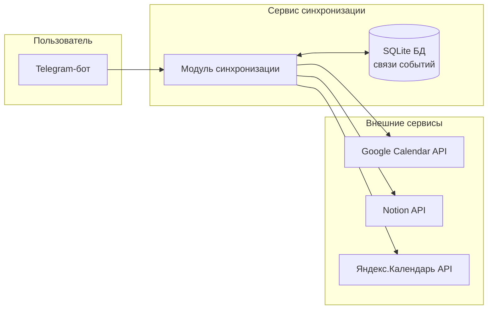

# Синхронизатор календарей

Проект позволяет синхронизировать события из **Google Calendar** и **Notion**  
в единый календарь — **Яндекс.Календарь**. Управление осуществляется через **Telegram-бота**.

## 1. Что будет видеть пользователь

Пользователь взаимодействует только с Telegram-ботом.

Команды:
- `/start` — приветствие и краткое описание возможностей бота;
- `/sync` — запустить синхронизацию «Google + Notion → Яндекс.Календарь»;
- `/status` — показать состояние последней синхронизации (сколько событий создано/пропущено);
- уведомления о конфликтах расписания

## 2. Какие задачи необходимо выполнить

1. **Интеграция с Google Calendar**

2. **Интеграция с Notion**.

3. **Интеграция с Яндекс.Календарём**

4. **Хранилище данных (SQLite)**
   - таблица связей между событиями.
   - функции чтения/записи связей.

5. **Логика синхронизации**
   - сбор событий из Google и Notion;
   - поиск новых событий, которых ещё нет в Яндекс.Календаре;
   - запись событий в Яндекс и сохранение связей;
   - проверка конфликтов расписания (пересечение по времени с существующими событиями).

6. **Telegram-бот**

7. **Документация и тестирование**

## 3. Сколько времени потребуется на каждую задачу

Проект выполняется двумя участниками.

| №  | Задача                                | Время, ч |
|----|---------------------------------------|:--------:|
| 1  | Подготовка проекта, структура, README |    3     |
| 2  | Интеграция с Google Calendar          |    5     |
| 3  | Интеграция с Notion                   |    5     |
| 4  | Интеграция с Яндекс.Календарём        |    6     |
| 5  | База данных (SQLite), модель данных   |    3     |
| 6  | Логика синхронизации и конфликты      |    10    |
| 7  | Telegram-бот (команды, диалоги)       |    10    |
| 8  | Финальное тестирование                |    3     |
|    | **Итого**                             | **45 ч** |

---

## 4. Кто что делает в команде

### 1. Толмаков Арсений (TL)
- подготовка **документации и README**;
- проектирование архитектуры и структуры БД;
- настройка окружения, requirements;
- разработка **Telegram-бота**:
  - команды `/start`, `/sync`, `/status`;
  - пользовательские сообщения и кнопки при конфликтах;
- код-ревью и объединение изменений.

### 2. Базаров Арсалан (Dev1)
- реализация интеграции с **Google Calendar** и **Яндекс.Календарём**;
- реализация интеграции с **Notion** (чтение событий/задач);
- разработка основного модуля синхронизации:
  - сбор событий;
  - создание событий в Яндекс;
  - базовая обработка конфликтов
- ручное тестирование сценариев.

---

## 5. Диаграмма

